<p align="center">
  
</p>

<h1 align="center">
  Hi, I'm Vian
  
</h1>

<p align="center">
  
</p>

<p align="center">
  <a href="https://github.com/vian0001">
    
  </a>
  <a href="https://jovian.my.id">
    
  </a>
  
  
</p>

<p align="center">
  
</p>

## `> SYSTEM.OVERVIEW`

<table>
  <tr>
    <td width="58%" valign="top">

### ⚡ About Me

```yaml
name: Vian
username: vian0001
role: Student Developer
portfolio: jovian.my.id
focus:
  - Networking
  - Cybersecurity
  - Web Development
mode:
  - Learn by doing
  - Build with curiosity
  - Improve every day
```

I’m a student developer who enjoys learning through action.

Instead of only reading theory, I like to:
- build things,
- break things,
- fix bugs,
- and turn every project into a level-up.

My main interests are **networking**, **cybersecurity**, and **web development**.  
I want my GitHub to feel like a **digital lab** where every repo shows progress, experiments, and growth.

### 🎯 Current Arc
- 🌐 Learning networking more deeply
- 🔐 Exploring cybersecurity and web security
- 💻 Building cleaner and better web projects
- 🐧 Spending more time in Linux
- 🚀 Improving one project at a time

    </td>
    <td width="42%" valign="top">
      
    </td>
  </tr>
</table>

---

## `> STACK.AND.TOOLS`

<p align="center">
  
</p>

<p align="center">
  
  
  
  
</p>

<p align="center">
  
  
</p>
---

## `> PORTAL.LINKS`

<p align="center">
  <a href="https://jovian.my.id">
    
  </a>
  <a href="https://github.com/vian0001?tab=repositories">
    
  </a>
</p>

<table>
  <tr>
    <td width="50%" align="center" valign="top">
      <h3>🌍 Portfolio Hub</h3>
      <p>
        My personal space to show projects, experiments, and the journey I'm building.
      </p>
      <a href="https://jovian.my.id">
        
      </a>
    </td>
    <td width="50%" align="center" valign="top">
      <h3>🧪 GitHub Lab</h3>
      <p>
        A place where I learn by building, testing ideas, and shipping small wins.
      </p>
      <a href="https://github.com/vian0001?tab=repositories">
        
      </a>
    </td>
  </tr>
</table>

---

## `> GITHUB.ANALYTICS`

<p align="center">
  
  
</p>

<p align="center">
  
</p>

<p align="center">
  
</p>

<p align="center">
  
  
</p>

---

## `> ACTIVITY.GRAPH`

<p align="center">
  
</p>

---


## `> QUEST.LOG`

<details open>
  <summary><b>📘 What I'm learning right now</b></summary>
  <br />
  <ul>
    <li>Networking fundamentals and deeper concepts</li>
    <li>Cybersecurity basics and web security mindset</li>
    <li>Linux workflow and terminal confidence</li>
    <li>Frontend and web development improvement</li>
  </ul>
</details>

<details open>
  <summary><b>🛠️ What I want this profile to represent</b></summary>
  <br />
  <ul>
    <li>Growth over perfection</li>
    <li>Consistency over hype</li>
    <li>Projects that show progress, not just decoration</li>
    <li>A student who is serious about leveling up</li>
  </ul>
</details>

<details>
  <summary><b>⚔️ Developer mindset</b></summary>
  <br />

```txt
Build something cool.
Break something weird.
Fix something messy.
Learn something useful.
Repeat.
```

</details>

---

## `> DEV.QUOTE`

<p align="center">
  
</p>

---

## `> CONTRIBUTION.SNAKE`

<p align="center">
  <picture>
    <source media="(prefers-color-scheme: dark)" srcset="https://raw.githubusercontent.com/vian0001/vian0001/output/github-snake-dark.svg" />
    <source media="(prefers-color-scheme: light)" srcset="https://raw.githubusercontent.com/vian0001/vian0001/output/github-snake.svg" />
    
  </picture>
</p>

---

## `> CONNECT`

<p align="center">
  <a href="https://github.com/vian0001">
    
  </a>
  <a href="https://jovian.my.id">
    
  </a>
</p>

<p align="center">
  <b>Thanks for visiting my profile.</b><br />
  <i>Still learning. Still building. Still improving.</i>
</p>

<p align="center">
  
</p>
