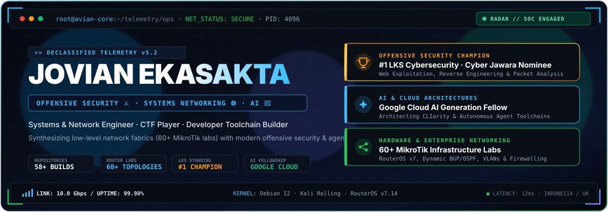

<div align="center">
  <a href="https://jovian.my.id">
    
  </a>
</div>

<div align="center">
  <a href="https://github.com/vian0001">
    
  </a>
</div>

<br/>

<div align="center">
  <a href="https://jovian.my.id">
    
  </a>
  <a href="https://linkedin.com/in/jovian-ekasakta">
    
  </a>
  <a href="mailto:jovianekasakta01@gmail.com">
    
  </a>
  <a href="https://github.com/vian0001?tab=repositories">
    
  </a>
</div>

<br/>


### 🛰️ System Telemetry & Executive Summary

```bash
jovian@core-systems:~$ neofetch --profile
```

```yaml
OS: Debian GNU/Linux x86_64 / Kali Rolling / MikroTik RouterOS v7
Host: Jovian Systems Kernel [v4.8-active]
Uptime: TKJ @ SMK Dwija Bhakti 01 Jombang
Fellowship: Google Cloud AI Generation (#TEAMGOOGLE)
Honors: #1 LKS Cybersecurity Champion · Cyber Jawara Nominee
Focus: Offensive Security, MikroTik Infrastructure, AI Agent Runtimes
Location: Indonesia 🇮🇩 / United Kingdom 🇬🇧
Status: Architecting secure developer tooling & AI workflow pipelines
```

> **I am Jovian (Vian)** — an infrastructure and security-focused engineer. I specialize in the intersection of **network systems (60+ MikroTik routing & switching labs)**, **offensive security / CTF web exploitation**, and **autonomous AI coding agent architectures**. Constantly exploring kernel primitives, low-level networking, and high-performance full-stack web platforms.

<br/>


### 🚀 Featured Engineering & Security Systems

| System / Repository | Mission & Technical Scope | Tech Stack | Deployment |
| :--- | :--- | :--- | :---: |
| 🛡️ [**CLIarity**](https://github.com/vian0001/CLIarity) | Windows-first desktop diagnostics for local AI coding-agent toolchains. Read-only, secure, and open-source. | `Python` `AI Diagnostics` `Windows CLI` |  |
| 🤖 [**Vian AI Coder**](https://vian-code.vercel.app/) | Generative AI engine transforming plain natural language prompts into live-deployed full-stack web applications. | `Next.js` `AI Agents` `Vercel` | [](https://vian-code.vercel.app/) |
| ⚔️ [**CTF Toolkit v3**](https://github.com/vian0001/CTF-tools3) | Red Team workbench & script suite for Capture-The-Flag challenges, web exploitation, and payload generation. | `Python` `Bash` `Security Tools` |  |
| 🎥 [**Capptivo (Jovian Edition)**](https://github.com/vian0001/capptivo-by-Jovian) | Forked & optimized screen recording/video editing suite tailored for technical demos and developer presentations. | `TypeScript` `Video Engine` `Desktop` |  |
| 🌐 [**Personal Cyberspace**](https://jovian.my.id) | Official engineering research lab, interactive portfolio, and technical telemetry — `jovian.my.id`. | `Next.js` `Tailwind` `Vercel` | [](https://jovian.my.id) |

<br/>


### 🧰 Technical Arsenal & Security Stack

<table>
  <tr>
    <td width="50%" valign="top">
      <h4>🌐 Networking & Systems Infrastructure</h4>
      <p>
        
        
        
        
        
        
        
      </p>
      <p><i>60+ MikroTik hardware/virtual labs, dynamic routing (OSPF/BGP), VLAN segregation, firewall packet filtering, bandwidth management.</i></p>
    </td>
    <td width="50%" valign="top">
      <h4>🛡️ Offensive Security & Pentesting</h4>
      <p>
        
        
        
        
        
        
      </p>
      <p><i>Web vulnerability research (OWASP Top 10), SQL injection, XSS, CSRF, reverse engineering basics, network packet analysis.</i></p>
    </td>
  </tr>
  <tr>
    <td width="50%" valign="top">
      <h4>🤖 AI Engineering & Cloud Tooling</h4>
      <p>
        
        
        
        
        
        
      </p>
      <p><i>Autonomous coding agent toolchains, prompt engineering, agentic SDKs, cloud AI workflows, serverless backend integrations.</i></p>
    </td>
    <td width="50%" valign="top">
      <h4>💻 Languages & Full-Stack Systems</h4>
      <p>
        
        
        
        
        
        
        
      </p>
      <p><i>High-performance scripts, automation pipelines, reactive dashboards, type-safe API clients, and modern responsive web apps.</i></p>
    </td>
  </tr>
</table>

<br/>


### 📈 Live GitHub Contribution Grid & Activity

<div align="center">
  
</div>

<br/>

<div align="center">
  
  
</div>

<br/>

<div align="center">
  
</div>

<br/>


### 📡 Direct Transmission & Comms Channels

<div align="center">
  <table>
    <tr>
      <td align="center" width="25%">
        <a href="https://jovian.my.id">
          <br/>
          <sub><b>jovian.my.id</b></sub>
        </a>
      </td>
      <td align="center" width="25%">
        <a href="https://linkedin.com/in/jovian-ekasakta">
          <br/>
          <sub><b>Jovian Ekasakta</b></sub>
        </a>
      </td>
      <td align="center" width="25%">
        <a href="mailto:jovianekasakta01@gmail.com">
          <br/>
          <sub><b>jovianekasakta01@gmail.com</b></sub>
        </a>
      </td>
      <td align="center" width="25%">
        <a href="https://github.com/vian0001">
          <br/>
          <sub><b>github.com/vian0001</b></sub>
        </a>
      </td>
    </tr>
  </table>
</div>

<br/>

<div align="center">
  <sub>⚡ Engineered with precision by <b>Jovian Ekasakta (vian0001)</b> · TKJ Engineer &amp; Security Researcher</sub>
</div>
