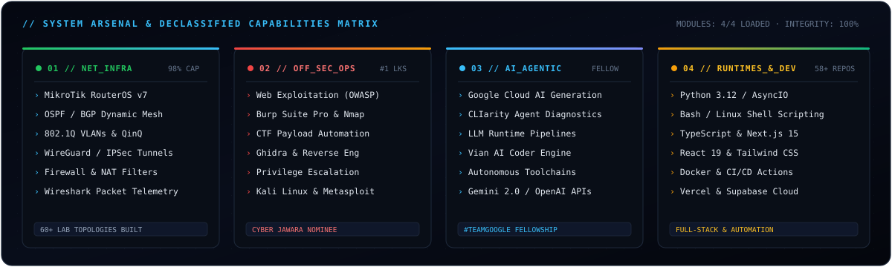

  

  
  
  
  

### 🛰️ DECLASSIFIED EXECUTIVE SUMMARY

> **Jovian (Vian)** — Systems & Network Infrastructure Engineer · Offensive Security / CTF Specialist · Autonomous AI Toolchain Architect.

* 🏆 **Offensive Security Honors:** **#1 LKS Cybersecurity Champion** & **Cyber Jawara Nominee** — specializing in web vulnerability exploitation (OWASP Top 10), reverse engineering, and custom payload scripting.
* 🌐 **Infrastructure & Networks:** Built **60+ MikroTik routing & switching labs** — mastering dynamic BGP/OSPF topologies, 802.1Q VLAN trunking, firewall filtering rules, and WireGuard VPN meshes.
* 🤖 **AI Fellow & Systems Dev:** **Google Cloud AI Generation Fellow** — architecting **CLIarity** (Windows-first diagnostic engine for coding agents) and **Vian AI Coder**.

### 🚀 FEATURED SYSTEMS & REPOSITORIES

<table>
  <tr>
    <td width="50%" valign="top">
      <h3>🛡️ <a href="https://github.com/vian0001/CLIarity">CLIarity</a></h3>
      
<b>Windows-first desktop diagnostics for local AI coding-agent toolchains.</b>

      
Designed for read-only security auditing, environment validation, and automated path telemetry without intrusive system modifications.

      

        
      

    </td>
    <td width="50%" valign="top">
      <h3>🤖 <a href="https://vian-code.vercel.app/">Vian AI Coder</a></h3>
      
<b>Generative AI engine transforming natural language prompts into live apps.</b>

      
Full-stack generation platform with live preview execution, code synthesis, and instant Vercel cloud deployments.

      

        
      

    </td>
  </tr>
  <tr>
    <td width="50%" valign="top">
      <h3>⚔️ <a href="https://github.com/vian0001/CTF-tools3">CTF Toolkit v3</a></h3>
      
<b>Red Team offensive security workbench & payload automation suite.</b>

      
Curated toolkit for Capture-The-Flag competitions, automating web payload generation, packet analysis, and shell privilege escalation.

      

        
      

    </td>
    <td width="50%" valign="top">
      <h3>🌐 <a href="https://jovian.my.id">Personal Cyberspace</a></h3>
      
<b>Official engineering research laboratory & interactive portfolio.</b>

      
Showcasing live telemetry, security research writeups, network lab documentation, and developer projects at <code>jovian.my.id</code>.

      

        
      

    </td>
  </tr>
</table>

### 🧰 TECHNICAL ARSENAL & CAPABILITIES MATRIX

  

### 📈 LIVE GITHUB TELEMETRY & ACTIVITY

  

 

  
  

 

  

### 📡 SECURE TRANSMISSION CHANNELS

  <a href="https://jovian.my.id"><code>jovian.my.id</code></a> · 
  <a href="https://linkedin.com/in/jovian-ekasakta"><code>linkedin/in/jovian-ekasakta</code></a> · 
  <a href="mailto:jovianekasakta01@gmail.com"><code>jovianekasakta01@gmail.com</code></a> · 
  <a href="https://github.com/vian0001"><code>github.com/vian0001</code></a>

  ⚡ Engineered with precision by <b>Jovian Ekasakta (vian0001)</b> · TKJ Engineer &amp; Security Researcher

