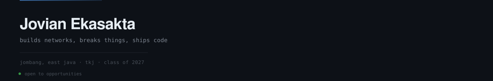

[jovian.my.id](https://jovian.my.id) · [repositories](https://github.com/vian0001?tab=repositories) · [linkedin](https://linkedin.com/in/jovian-ekasakta) · [jovianekasakta01@gmail.com](mailto:jovianekasakta01@gmail.com)

---

SMK student (TKJ) from East Java. I build network infrastructure, do CTF
competitions, and ship web tools. I like understanding how things work at the
lowest level — from MikroTik routing tables to how TSMC prints transistors.

Currently prepping for LKS Cybersecurity and building developer tools on the side.

---

### projects

**[CLIarity](https://github.com/vian0001/CLIarity)** — desktop diagnostics for AI coding agents. `rust` `windows`

**[CTF Toolkit](https://github.com/vian0001/CTF-tools3)** — scripts and tools I actually use in CTF comps. `python` `bash`

**[jovian.my.id](https://jovian.my.id)** — personal site, portfolio, and writeups. `next.js` `tailwind`

**[worthdeck](https://github.com/vian0001/worthdeck)** — deck builder and presentation tool. `typescript`

---

### Frontend Development

<table>
  <tr>
    <td align="center" width="76">
       
      HTML5
    </td>
    <td align="center" width="76">
       
      CSS3
    </td>
    <td align="center" width="76">
       
      JavaScript
    </td>
    <td align="center" width="76">
       
      React
    </td>
    <td align="center" width="76">
       
      Next.js
    </td>
    <td align="center" width="76">
       
      Tailwind
    </td>
    <td align="center" width="76">
       
      Three.js
    </td>
    <td align="center" width="76">
       
      GSAP
    </td>
  </tr>
</table>

### Backend Development

<table>
  <tr>
    <td align="center" width="76">
       
      PHP
    </td>
    <td align="center" width="76">
       
      Laravel
    </td>
    <td align="center" width="76">
       
      Python
    </td>
    <td align="center" width="76">
       
      XAMPP
    </td>
  </tr>
</table>

### DevOps & Development Tools

<table>
  <tr>
    <td align="center" width="76">
       
      Git
    </td>
    <td align="center" width="76">
       
      GitHub
    </td>
    <td align="center" width="76">
       
      GitLab
    </td>
    <td align="center" width="76">
       
      Docker
    </td>
    <td align="center" width="76">
       
      VS Code
    </td>
    <td align="center" width="76">
       
      JetBrains
    </td>
    <td align="center" width="76">
       
      NPM
    </td>
    <td align="center" width="76">
       
      Vercel
    </td>
    <td align="center" width="76">
       
      Cloudflare
    </td>
  </tr>
</table>

### Network & Infrastructure

<table>
  <tr>
    <td align="center" width="76">
       
      MikroTik
    </td>
    <td align="center" width="76">
       
      Cisco
    </td>
    <td align="center" width="76">
       
      Wireshark
    </td>
    <td align="center" width="76">
       
      WireGuard
    </td>
    <td align="center" width="76">
       
      Debian
    </td>
    <td align="center" width="76">
       
      Kali Linux
    </td>
    <td align="center" width="76">
       
      Linux
    </td>
  </tr>
</table>

### Security & CTF Specialization

> **Primary Roles:** `Web Exploitation` · `Cryptography` · `Digital Forensics`

#### Red Team & Offensive Security

<table>
  <tr>
    <td align="center" width="76">
       
      Burp Suite
    </td>
    <td align="center" width="76">
       
      Metasploit
    </td>
    <td align="center" width="76">
       
      Hashcat
    </td>
    <td align="center" width="76">
       
      OWASP
    </td>
    <td align="center" width="76">
       
      Kali Linux
    </td>
    <td align="center" width="76">
       
      Tor
    </td>
    <td align="center" width="76">
       
      Bash
    </td>
  </tr>
</table>

#### Blue Team & Defensive / Forensics

<table>
  <tr>
    <td align="center" width="76">
       
      Wireshark
    </td>
    <td align="center" width="76">
       
      VirusTotal
    </td>
    <td align="center" width="76">
       
      Snort
    </td>
    <td align="center" width="76">
       
      Splunk
    </td>
    <td align="center" width="76">
       
      Elastic
    </td>
    <td align="center" width="76">
       
      Palo Alto
    </td>
  </tr>
</table>

---

LKS Cybersecurity #1 · Cyber Jawara nominee · Google Cloud AI Generation fellow · 60+ mikrotik labs

---

jombang · 2026
